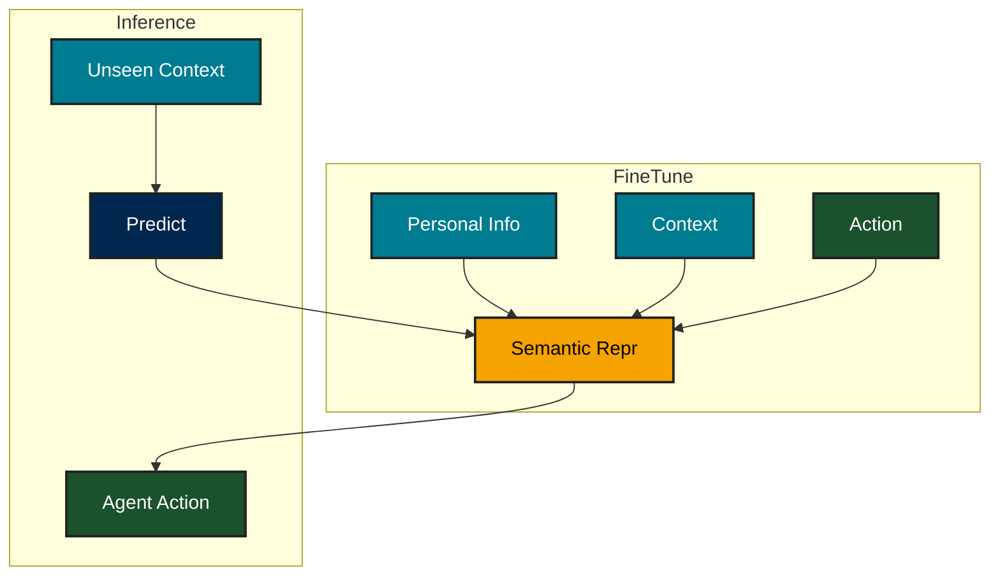
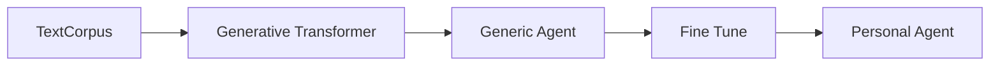
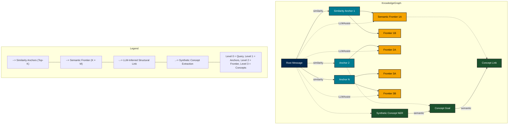

# A billion PSAgents - Personal sovreign agents

PSAgent are sovreign AI artifacts(models or otherwise) that can perform social/financial interaction on behalf on an individual. The agent performed actions should ideally pass the "*personal indistinguistability experiment*" where an third party observer should not be able to distinguish actions as initiated by actual individual or his/her digital PSAgent incarnation.

> { P(Classify<sub>ExpAgent</sub>(Context) = Correct)    -  P(Classify<sub>ExpHuman</sub>(Context) = Correct) } == 0

## Personalality Indistiguisabality (PI) VS Turing test

The PI test is a extension of the **Turing Test** where we are not just testing for human emulation, but we are testing for a "particular human" being emulated.

## Conceptual recepie for building PSAgent

The design space of building PSAgents can be explored in many way and one generic forumulation is converting (personal information, context -> actions) into a semantic representation, and exterpolating actions for unseen contexts.



# Practical Approach from implementing PSAgent

1. Fine tuning:
   Ideally collect ALL information about the human and fine tune a LLM with questions + answers pairs of the form
   Prompt - Hypothetical Question/Scenario
   Response - Ideal Answer/respose from the human
   The resulting fine tuned model will be an agent that will have the persona of the human whose info set we trained on.

Overall this transformation can be summarized as



Note: The fine tuning step takes of semantic conversion of personal information into model weights.

2. RAG approach:
   This approach fundamentally differs from the fine tuning approach, where by we are using a Generic Agent to answer questions based on personalization info that is fed as the prompt. Its like asking a a friend/confidante/spouse/partner about how a person would react in a context !

Both the rag and fine-tuning approach have distinct qualitaitve and cost tradeoff. Most importantly the RAG approach is a low cost approach and scales well for large number of persona. The fine tuning approach will result in superior results on the indistinguisablity test (reasons not explained here), but will not scale to the load parameter of number of users. As number of users increase fine tuning and operational cost of individual LLMs will become exorbitantly prohibitive.

### Drilling down design space for a RAG based approach

We want to design a system for a large number of PSAgents thus we prefer the RAG approach for its scale. The functional goal is well connected knowledge graph and the trade-off is balancing the connectivity and avoiding a degnerate case of a fully connected graph. The data set is not huge, so scaling performance for single PSA agent is not a top concern, but we would like the data pipeline to be dynamic ie. we should be able to create, update and load such agents quickly in-and-out of context.

##### General Topology for the graph.

The schema for the graph can be derived in multiple ways. Its important that we don't throw the kitchen sink at the problem which will result in hyper connected graph (overfitting). Instead we limit ourselves to 3 types of relations and each having a well defined reasoning for it. We start with text message as nodes

1. Semantic threshold. Tsematicthreshold
   Connect related text messsage nodes with a semantic similarity threshold.
2. [LLM assisted] connectivity for distant nodes  Tllmthreshold = Range(Tmin, Tmax)
   We do LLM assisted connectivity
3. [LLM Assist] Synthetic Fanout for Nodes (NER, Intent, causal etc)
   So far we are only connecting nodes that originate from user text messages. We augment these node with LLM generated info/metadata nodes that hang off the text nodes.
4. Closing the loop.
   The newly nodes are connected in the existing nodes using a Semantic threshold step of 1.
5. Quantifying the relation strength.
   Conceptually we would like each edge to have a weight and this that we can extract a strongly weighted sub-graph to act as augmention for information retrieval. For now we simpilfy by distance weighted connectivity ie. closer nodes are more relevant.

### State Pruning and Semantic Hierarchy

To avoid the combinatorial explosion of pairwise LLM comparisons across all messages, we employ a structured state pruning strategy built around a two-tier semantic hierarchy. The first tier, called Similarity Anchors, consists of the Top-K messages closest to a given message in embedding space—these represent its immediate semantic neighborhood. The second tier, the Semantic Frontier, is formed by retrieving the Top-M nearest neighbors for each anchor. Rather than evaluating all possible message pairs, we restrict LLM-based relationship extraction to this pruned frontier, where meaningful structural relationships are most likely to emerge. This approach balances scalability with expressiveness, allowing us to discover rich graph structure without incurring O(N²) LLM queries.



# PS Agents

A Go application for processing and analyzing messages using embeddings and graph databases.

## Development Environment

### Prerequisites

- Go 1.22 or later
- Nix package manager
- Neo4j (for graph database)

### Setup

1. Clone the repository:
   ```bash
   git clone https://github.com/yourusername/psagents.git
   cd psagents
   ```

2. Enter the Nix development shell:
   ```bash
   nix develop
   ```

3. Install dependencies:
   ```bash
   go mod download
   ```

4. Copy the example config:
   ```bash
   cp config/config.example.yaml config/config.yaml
   ```

5. Edit `config/config.yaml` with your settings.

### Running Tests

```bash
go test ./...
```

## Usage

### Ingest Command

The `ingest` command processes messages and generates embeddings. It supports both full processing and development mode.

```bash
# Process all messages
go run cmd/ingest/main.go -config config/config.yaml

# Process only first 20 messages (development mode)
go run cmd/ingest/main.go -config config/config.yaml -dev
```

Command line flags:
- `-config`: Path to config file (default: "config/config.example.yaml")
- `-dev`: Use development file with first 20 messages (default: false)

The command will:
1. Load the configuration file
2. Create a development file if `-dev` flag is used
3. Generate embeddings for the messages
4. Save the embeddings to the configured output directory

## Project Structure

```
.
├── cmd/
│   └── ingest/          # Ingest command for processing messages
├── config/              # Configuration package
├── internal/
│   ├── embeddings/      # Embedding generation
│   └── graph/          # Graph database operations
└── README.md
```

## Configuration

The application uses a YAML configuration file with the following sections:

- `server`: Server configuration
- `pipeline`: Pipeline settings
- `graph`: Graph database configuration
- `embeddings`: Embedding model settings
- `llm`: Language model configuration
- `data`: Data directory paths
- `logging`: Logging configuration

See `config/config.example.yaml` for a complete example.
