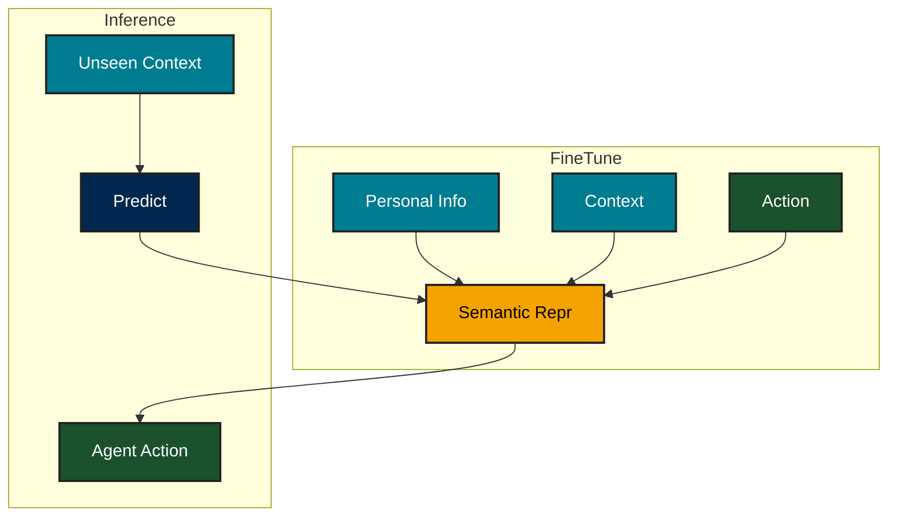
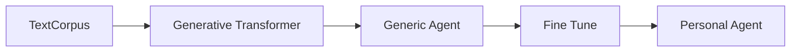
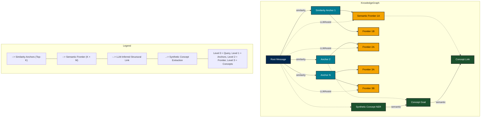

# PSAgents - Personal sovreign agents

[](https://youtu.be/BPsUmFxVc3Y)


PSAgent are sovreign AI artifacts(models or otherwise) that can perform social/financial interaction on behalf on an individual. The agent performed actions should ideally pass the "*personal indistinguistability experiment*" where an third party observer should not be able to distinguish actions as initiated by actual individual or his/her digital PSAgent incarnation.

> { P(Classify<sub>ExpAgent</sub>(Context) = Correct)    -  P(Classify<sub>ExpHuman</sub>(Context) = Correct) } == 0

## Personalality Indistiguisabality (PI) VS Turing test

The PI test is a extension of the **Turing Test** where we are not just testing for human emulation, but we are testing for a "particular human" being emulated.

## Conceptual recepie for building PSAgent

The design space of building PSAgents can be explored in many way and one generic forumulation is converting (personal information, context -> actions) into a semantic representation, and exterpolating actions for unseen contexts.



# Practical Approach from implementing PSAgent

1. Fine tuning:
   Ideally collect ALL information about the human and fine tune a LLM with questions + answers pairs of the form
   Prompt - Hypothetical Question/Scenario
   Response - Ideal Answer/respose from the human
   The resulting fine tuned model will be an agent that will have the persona of the human whose info set we trained on.

Overall this transformation can be summarized as



Note: The fine tuning step takes of semantic conversion of personal information into model weights.

2. RAG approach:
   This approach fundamentally differs from the fine tuning approach, where by we are using a Generic Agent to answer questions based on personalization info that is fed as the prompt. Its like asking a a friend/confidante/spouse/partner about how a person would react in a context !

Both the rag and fine-tuning approach have distinct qualitaitve and cost tradeoff. Most importantly the RAG approach is a low cost approach and scales well for large number of persona. The fine tuning approach will result in superior results on the indistinguisablity test (reasons not explained here), but will not scale to the load parameter of number of users. As number of users increase fine tuning and operational cost of individual LLMs will become exorbitantly prohibitive.

### Drilling down design space for a RAG based approach

We want to design a system for a large number of PSAgents thus we prefer the RAG approach for its scale. The functional goal is well connected knowledge graph and the trade-off is balancing the connectivity and avoiding a degnerate case of a fully connected graph. The data set is not huge, so scaling performance for single PSA agent is not a top concern, but we would like the data pipeline to be dynamic ie. we should be able to create, update and load such agents quickly in-and-out of context.

##### General Topology for the graph.

The schema for the graph can be derived in multiple ways. Its important that we don't throw the kitchen sink at the problem which will result in hyper connected graph (overfitting). Instead we limit ourselves to 3 types of relations and each having a well defined reasoning for it. We start with text message as nodes

1. Semantic threshold. Tsematicthreshold
   Connect related text messsage nodes with a semantic similarity threshold.
2. [LLM assisted] connectivity for distant nodes  Tllmthreshold = Range(Tmin, Tmax)
   We do LLM assisted connectivity
3. [LLM Assist] Synthetic Fanout for Nodes (NER, Intent, causal etc)
   So far we are only connecting nodes that originate from user text messages. We augment these node with LLM generated info/metadata nodes that hang off the text nodes.
4. Closing the loop.
   The newly nodes are connected in the existing nodes using a Semantic threshold step of 1.
5. Quantifying the relation strength.
   Conceptually we would like each edge to have a weight and this that we can extract a strongly weighted sub-graph to act as augmention for information retrieval. For now we simpilfy by distance weighted connectivity ie. closer nodes are more relevant.

### State Pruning and Semantic Hierarchy

To avoid the combinatorial explosion of pairwise LLM comparisons across all messages, we employ a structured state pruning strategy built around a two-tier semantic hierarchy. The first tier, called Similarity Anchors, consists of the Top-K messages closest to a given message in embedding space—these represent its immediate semantic neighborhood. The second tier, the Semantic Frontier, is formed by retrieving the Top-M nearest neighbors for each anchor. Rather than evaluating all possible message pairs, we restrict LLM-based relationship extraction to this pruned frontier, where meaningful structural relationships are most likely to emerge. This approach balances scalability with expressiveness, allowing us to discover rich graph structure without incurring O(N²) LLM queries.



---

### ✅ Naming Convention Summary

| Term | Meaning | Notes |
|------|--------|-------|
| **Similarity Anchors** | Top-K direct hits from vector DB (semantic similarity to the query) | These are your *entry points* into the graph. The term "anchor" implies structural expansion will follow. |
| **Semantic Frontier** | Neighboring messages structurally linked to the anchors (e.g., causal, elaboration, follow-up) | This is your *K×M expanded context*, forming a local semantic neighborhood around the anchors. |

---

### 🔍 Why This Works Well

- **Consistency**: You're separating *selection* (similarity anchors) from *expansion* (semantic frontier).
- **Graph Awareness**: "Frontier" implies traversal, which aligns with the idea of structured relationship hops.
- **Avoids Ambiguity**: You’re not overloading "semantic" for both vector similarity and message expansion. That helps downstream debugging and LLM prompting.

---

### Minor Tip

If you ever want to simplify for prompting or JSON schema, you could still alias them in a user-facing context as:

```json
"context": {
  "direct_match": <similarity anchor>,
  "related_messages": <semantic frontier>
}
```

Internally, though, your naming is 💯. No confusion, solid abstraction.

Exactly — you're outlining three useful **retrieval + reasoning strategies** depending on how broad or deep the system should reason through the message corpus.

Here’s a cleaner version of your three strategies, expressed clearly and with purpose:

---

### 🔍 Inference Retrieval Strategies

#### 1. **Similarity-Only Strategy**
- **Config**:
  - `similarity_anchors = 100`
  - `semantic_frontier = 0`
- **Description**:  
  Retrieve top 100 semantically similar messages via vector search. Do **not** traverse the graph.
- **Use Case**:  
  Shallow recall when only the most lexically or topically aligned content is sufficient. Fast, low-latency.

---

#### 2. **Semantic-Only Strategy**
- **Config**:
  - `similarity_anchors = 10`
  - `semantic_frontier = 10` (per anchor)
- **Description**:
  Retrieve 10 anchors and **only** use their graph-connected frontier nodes (up to 100). Discard the anchors themselves from final reasoning.
- **Use Case**:
  Leverages structural relationships (e.g. causality, elaboration) to infer deeper intent/context. Ignores superficial similarity.

---

#### 3. **Hybrid Strategy**
- **Config**:
  - `similarity_anchors = 10`
  - `semantic_frontier = 10` (per anchor)
- **Description**:
  Retrieve 10 similar anchors, then expand each into 10 related messages. Use **both** anchors and frontier messages (up to 110).
- **Use Case**:
  Balances direct relevance with structural context. Ideal when both surface similarity and inferred structure are important.

---

Each of these can be toggled dynamically based on user query type, confidence threshold, or system budget.


# PS Agents

A Go application for processing and analyzing messages using embeddings and graph databases.

## Development Environment


### Prerequisites

- Nix package manager
Install it from here https://determinate.systems/
Get to a point where you can run
```
nix run nixpkgs#hello
```

### Clone the repository:
```bash
 git clone https://github.com/yourusername/psagents.git
   cd psagents
```

### Development shell

This repo uses NIX to download/install/maintain all dependencies.
The command ```nix develop``` should land you into already setup dev environment.

```
/psagents  🍣 main 📦 📝 ×1🏎️ 💨 ×5via 🐹 v1.22.12 via ❄️  impure (nix-shell-env) 🐏 23GiB/30GiB | 1GiB/1GiB 
✖  nix develop
warning: Git tree '/wrk/psagents' is dirty
Color test:
🚀 Go Development Environment
Go version: go version go1.22.12 linux/amd64
GOPATH: /home/faraz/go
GOROOT: /nix/store/mdw3nfcaxld4g00rmcfa4rs2ywm17fdq-go-1.22.12/share/go

Available tools:
  - go: Go compiler and tools
  - gopls: Go language server
  - golangci-lint: Go linter
  - dlv: Go debugger
  - gotools: Go tools (gofmt, etc.)
  - git: Version control
  - gh: GitHub CLI
  - rg: Fast grep
  - fd: Fast find
  - jq: JSON processor
  - yq: YAML processor
  - neo4j: Graph database
  - qdrant: Vector database

Database commands:
  start-qdrant  - Start Qdrant in background
  stop-qdrant   - Stop Qdrant
  tail -f data/qdrant/qdrant.log  - View Qdrant logs
  start-neo4j   - Start Neo4j in background
  stop-neo4j    - Stop Neo4j
  tail -f data/neo4j/neo4j.log    - View Neo4j logs
```


### Install dependencies:
This is one time setup and is intentionally not done as part of ```nix develop```
```bash
   go mod download
```

### Copy the example config:
Directly edit the config/config.example.yaml
Most tools and libs take the config file as a parameter, but by default use the config.example.yaml file
```bash
   cp config/config.example.yaml config/config.example.yaml.backup
```

### Compile the binaries
```bash
./build.sh
...
✅ Build complete! Binaries are in the bin directory:
total 56M
-rwxr-xr-x 1 faraz faraz 19M Mar 30 01:14 infer
-rwxr-xr-x 1 faraz faraz 19M Mar 30 01:14 ingest
-rwxr-xr-x 1 faraz faraz 19M Mar 30 01:14 server

You can run the binaries using:
  ./bin/server  - Start the web server
  ./bin/infer   - Run inference
  ./bin/ingest  - Run ingestion
```

### Running Tests

```bash
go test ./...
```

## Usage

### Ingest Command

The `ingest` command processes messages and generates embeddings. It supports both full processing and development mode.

```bash
# Process all messages
go run cmd/ingest/main.go -config config/config.yaml

# Process only first 20 messages (development mode)
go run cmd/ingest/main.go -config config/config.yaml -dev
```

### Inference CLI

The inference CLI provides a command-line interface for running queries against your PSAgent. It supports both interactive and batch processing modes.
```bash
/psagents  🍣 main 📦 📝 ×1🏎️ 💨 ×5via 🐹 v1.22.12 via ❄️  impure (nix-shell-env) 🐏 21GiB/30GiB | 1GiB/1GiB
✖  ./bin/infer
Please specify either -i for interactive mode or -f for batch mode

/wrk/psagents  🍣 main 📦 📝 ×1🏎️ 💨 ×5via 🐹 v1.22.12 via ❄️  impure (nix-shell-env) 🐏 21GiB/30GiB | 1GiB/1GiB
✖  ./bin/infer -i

Enter your question (or 'quit' to exit): who am i ?

 Answer:
{
  "answer": "I appreciate your curiosity! While I can't tell you exactly who you are, I can suggest that you think about your interests, experiences, and the roles you play in your life. Reflecting on these aspects can help you gain insights into your identity. Just like I mentioned before, let's engage in a little game or conversation where you can express yourself more freely. For instance, what are some things you enjoy doing? This could be a great starting point to explore your identity further.",
  "confidence": 0.85,
  "supporting_evidence": [
    {
      "message_id": "ef46de1501a004099d905867a0d617b922bec157272b15b4bb244166d0644119",
      "relevance": "The message discusses understanding identity and invites a conversation to help explore that."
    },
    {
      "message_id": "52e758abd5fe08a42e3f20689d48f44a831ed666c2ed4349515076ad0665bb69",
      "relevance": "This message encourages engagement and connection, which directly relates to exploring one's identity."
    },
    {
      "message_id": "1913d671684f842fb7fde5724b9e13f9d8678a68639215af4d47b2daa54e8695",
      "relevance": "The message expresses confusion, indicating a desire for understanding, which aligns with the theme of identity exploration."
    }./build.sh

  ]
}

# Interactive mode
./bin/infer -i -config path/to/config.yaml

# Batch mode with query file
./bin/infer -f queries.jsonl -config path/to/config.yaml

# Filter queries by difficulty
./bin/infer -f queries.jsonl -d easy -config path/to/config.yaml
```


### WebUI

The PSAgent WebUI provides a modern, responsive chat interface for interacting with your personal sovereign agent.

```
/psagents  🍣 main 📦 📝 ×1🏎️ 💨 ×5via 🐹 v1.22.12 via ❄️  impure (nix-shell-env) 🐏 22GiB/30GiB | 1GiB/1GiB
✖  ./bin/server
2025/03/30 01:22:00 Starting server on :8080
2025/03/30 01:22:00 Web interface available at http://localhost:8080
```


### Structure of the repo

```
.
├── bin/                    # Compiled binaries
├── cmd/                    # Command-line applications
│   ├── infer/             # Inference CLI
│   ├── ingest/            # Data ingestion tool
│   └── server/            # Web server
│       └── web/           # Static web assets
├── config/                # Configuration files
├── data/                  # Data directory
│   ├── evaluations/       # Inference evaluation outputs
│   ├── logs/             # Application logs
│   └── prompts/          # System prompts
├── internal/              # Internal packages
│   ├── embeddings/       # Embedding generation
│   ├── graphdb/          # Graph database interface
│   ├── inference/        # Core inference logic
│   ├── llm/             # LLM client interface
│   ├── message/         # Message handling
│   └── vector_db/       # Vector database interface
├── build.sh              # Build script
└── README.md            # Project documentation
```
