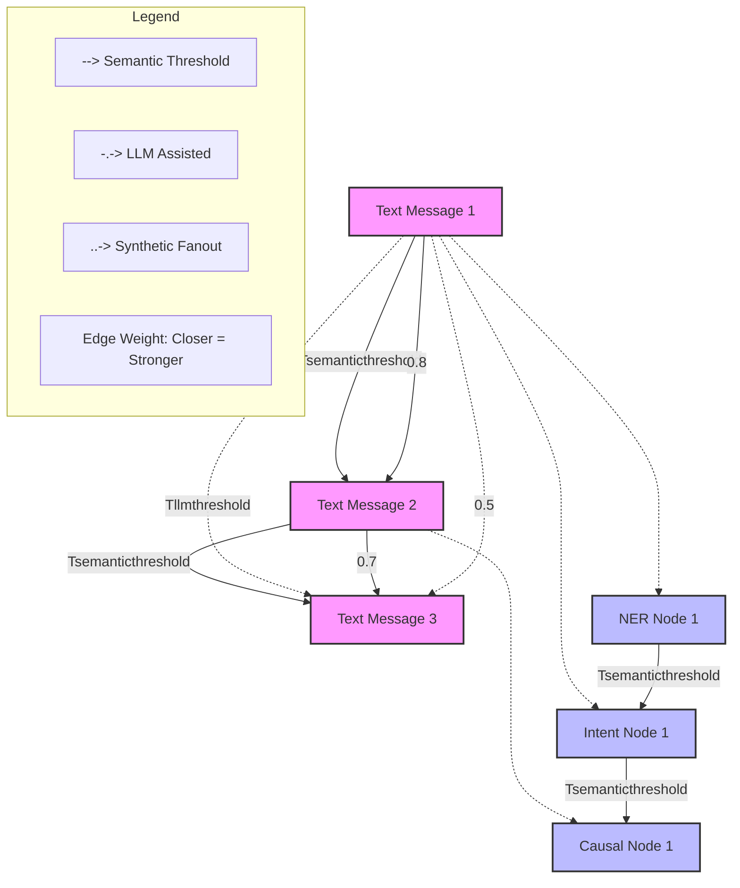

```mermaid
graph TD
    %% Main text message nodes
    TM1[Text Message 1]
    TM2[Text Message 2]
    TM3[Text Message 3]
    
    %% Synthetic nodes (NER, Intent, etc.)
    NER1[NER Node 1]
    INT1[Intent Node 1]
    CAU1[Causal Node 1]
    
    %% Semantic threshold connections (solid lines)
    TM1 -->|Tsemanticthreshold| TM2
    TM2 -->|Tsemanticthreshold| TM3
    
    %% LLM assisted distant connections (dashed lines)
    TM1 -.->|Tllmthreshold| TM3
    
    %% Synthetic fanout connections (dotted lines)
    TM1 ..-> NER1
    TM1 ..-> INT1
    TM2 ..-> CAU1
    
    %% Closing loop connections (solid lines with different style)
    NER1 -->|Tsemanticthreshold| INT1
    INT1 -->|Tsemanticthreshold| CAU1
    
    %% Edge weights based on distance (shown as numbers)
    TM1 -->|0.8| TM2
    TM2 -->|0.7| TM3
    TM1 -.->|0.5| TM3
    
    %% Legend
    subgraph Legend
        L1[--> Semantic Threshold]
        L2[-.-> LLM Assisted]
        L3[..-> Synthetic Fanout]
        L4[Edge Weight: Closer = Stronger]
    end
    
    %% Styling
    classDef textNode fill:#f9f,stroke:#333,stroke-width:2px
    classDef syntheticNode fill:#bbf,stroke:#333,stroke-width:2px
    
    class TM1,TM2,TM3 textNode
    class NER1,INT1,CAU1 syntheticNode
``` 